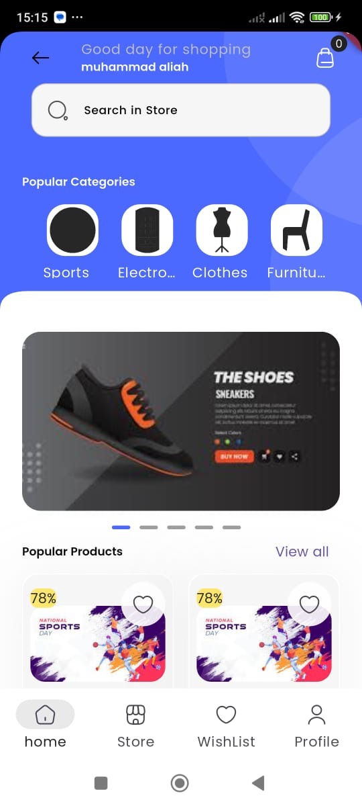
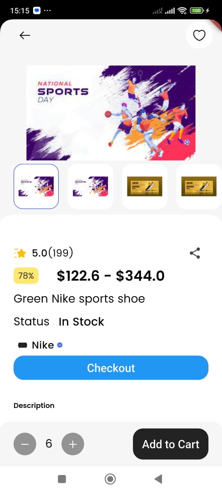
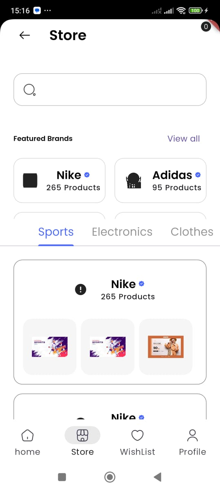
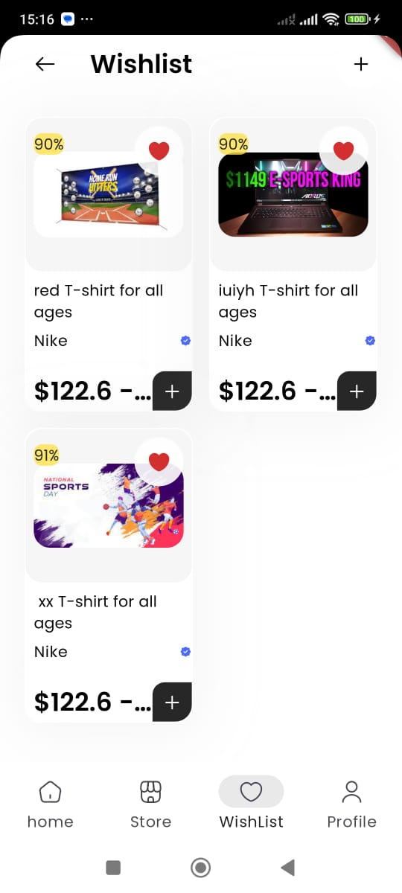
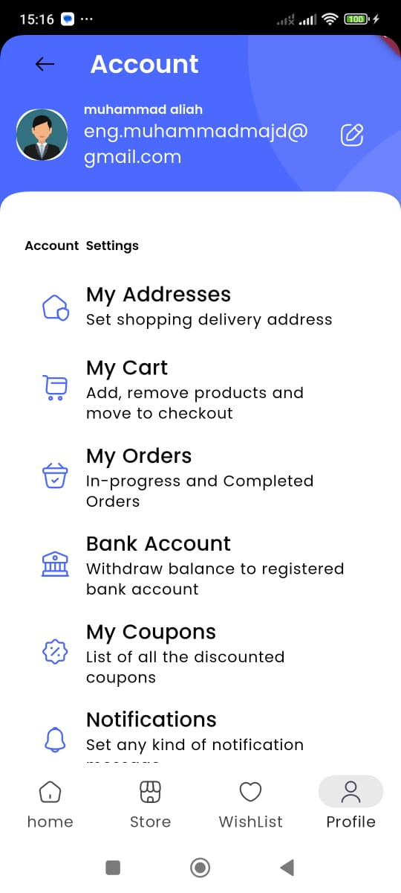
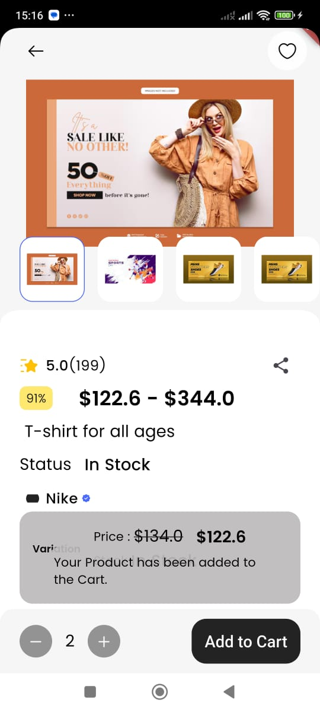
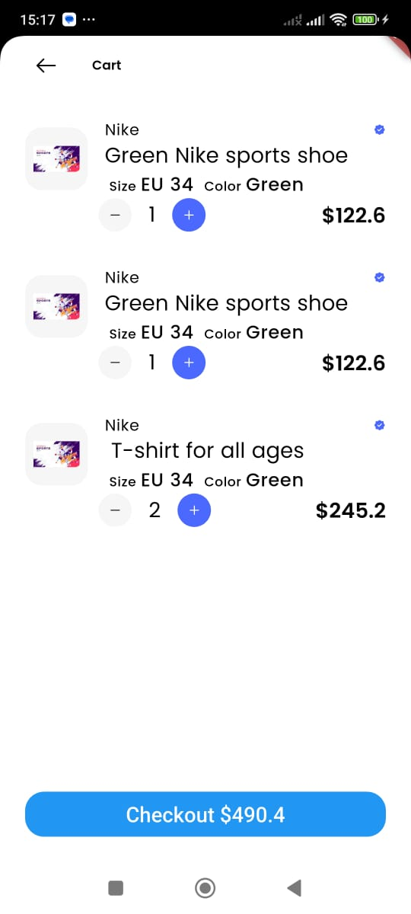

<<<<<<< HEAD
# M-Shop
=======

A new Flutter project.

## Getting Started

 M_shop is a flutter project which allow clients to buy products online .

## Project 

A few resources to get you started if this is your first Flutter project:

- [Lab: Write your first Flutter app](https://docs.flutter.dev/get-started/codelab)
- [Cookbook: Useful Flutter samples](https://docs.flutter.dev/cookbook)

For help getting started with Flutter development, view the
[online documentation](https://docs.flutter.dev/), which offers tutorials,
samples, guidance on mobile development, and a full API reference.
>>>>>>> 8def625 (Initial commit)
